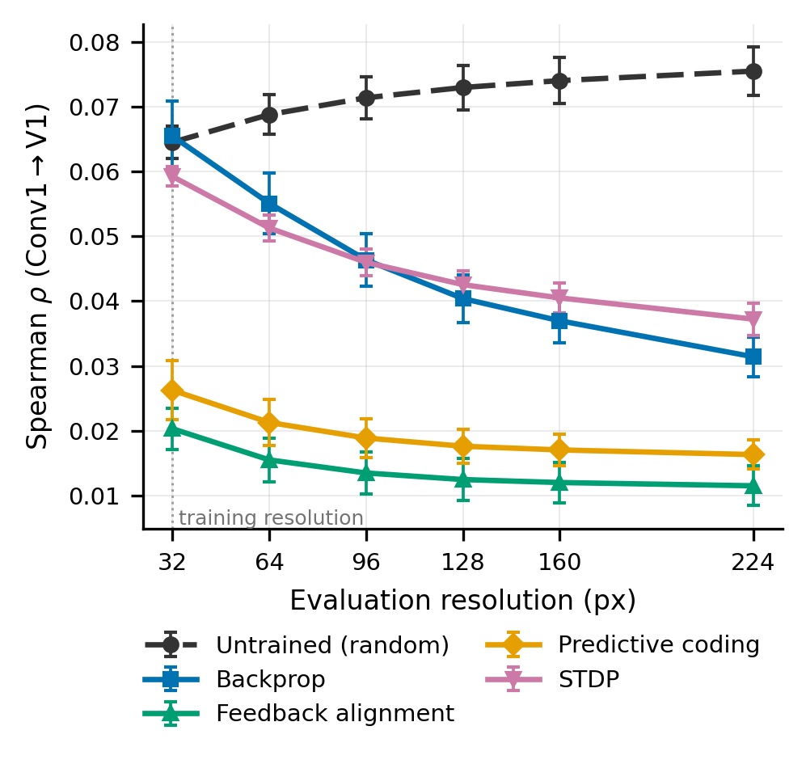

# Evaluation Resolution Confounds Learning-Rule Comparisons in Model–Brain RSA of Early Visual Cortex

**The finding that untrained networks rival backpropagation at V1 is largely a
function of the resolution at which the model is evaluated: the gap runs from
−0.001 ± 0.007 at the 32 px training resolution to +0.044 ± 0.006 at 224 px.**

Nils Leutenegger · Independent Researcher, Switzerland
Paper: **[arXiv:2608.12408](https://arxiv.org/abs/2608.12408)** ·
Accepted as a poster at the **Bernstein Conference 2026**



*V1 alignment (Conv1→V1), mean Spearman ρ ± SEM across 5 seeds. Every trained
condition peaks at the 32 px training resolution and declines; only the untrained
network rises. Training is always at 32 px — only the evaluation resolution varies,
with weights and normalization held fixed.*

---

## The effect

Random − Backprop gap at V1 (Conv1→V1), across the full sweep. Mean ± SEM over the
five seeds (42, 123, 456, 789, 1337), and the number of individual seeds for which
the gap is positive. Reproduce this table with
[`results/bnfix_sweep.csv`](results/bnfix_sweep.csv).

| Evaluation resolution | Untrained ρ | Backprop ρ | **Gap (Random − Backprop)** | Seeds positive |
|---|---|---|---|---|
| 32 px *(training resolution)* | 0.065 | 0.065 | **−0.001 ± 0.007** | 3/5 |
| 64 px | 0.069 | 0.055 | **+0.014 ± 0.007** | 3/5 |
| 96 px | 0.071 | 0.046 | **+0.025 ± 0.007** | 5/5 |
| 128 px | 0.073 | 0.040 | **+0.033 ± 0.006** | 5/5 |
| 160 px | 0.074 | 0.037 | **+0.037 ± 0.006** | 5/5 |
| 224 px *(the usual choice)* | 0.076 | 0.031 | **+0.044 ± 0.006** | 5/5 |

The gap grows monotonically across all six resolutions. At the resolution the models
were trained on there is no effect; at the resolution normally used to evaluate them
it is large.

The same table under the per-subject averaging scheme (`rho_sub_mean`) runs from
+0.000 ± 0.005 to +0.032 ± 0.004 — smaller in absolute terms, identical in shape.
The two schemes are **not** interchangeable and the distinction is documented in
[`results/README.md`](results/README.md#1-rho-vs-rho_sub_mean).

**It is not an artifact of the obvious candidates.** Four mechanisms were tested and
none accounts for it — train/eval resolution matching (an ImageNet ResNet-50 and a
Swin-Tiny, both *trained* at 224 px, also align best at low resolution); low-level
Gabor and pixel structure; the normalization state of the untrained baseline (a 2×2
calibration design holding the convolutional weights bit-identical); and convergence
of the pooled descriptor toward a global brightness statistic. A fifth experiment
locates it: capping image detail at 32 px while letting the pooled positions grow
twelvefold removes about 90% of the effect, so the dependence lives on the image-content
axis rather than the pooling axis.

---

## What this does and does not claim

**It does claim.**

- In this setting, the V1 ranking between untrained and backprop-trained networks
  moves with evaluation resolution, and the untrained network's advantage is close to
  zero at the training resolution.
- The dependence is general across the five conditions, human fMRI and (directionally)
  macaque electrophysiology, the whole training trajectory, and three architecture
  families.
- The published "training degrades V1 alignment" result for backpropagation appears at
  224 px and vanishes at the 32 px training resolution.
- The dependence is carried by image detail above the training resolution, not by the
  number of pooled positions.
- One learning effect survives across the entire sweep: backprop above untrained at a
  higher area (LOC), +0.019 at 32 px and +0.018 at 224 px, 5/5 seeds throughout.

**It does not claim.**

- **Not that 32 px is correct and 224 px is wrong.** The recommendation is to evaluate
  at the training resolution *and* at several others, and to state which was used. A
  receptive-field-matching criterion would be a principled way to choose; this paper
  does not establish one.
- **No mechanism.** Four accounts are excluded and the effect is localized to the
  content axis, but *why* detail above 32 px helps random filters and hurts trained
  ones is open. That is stated rather than closed prematurely.
- **Not a claim about model–brain alignment in general.** All results use rank
  correlation between RDMs built from *globally pooled* features, which discards
  spatial structure before the comparison. A fitted readout on the full feature map —
  standard elsewhere, and untested here — might place the models higher.
- **The macaque arm is single-seed.** "Across two species" should be read as
  directional support, not as two independently powered replications. The two macaque
  datasets also use different stimuli for different regions.
- **Small absolute numbers.** A single scalar luminance value per image reaches
  ρ = 0.075 against the V1 RDM, essentially matching the untrained network's 0.076.
  That bounds what this style of comparison can resolve at V1 in this dataset —
  including for the results reported here.
- **The dose–response is one effect, not six tests.** Six resolutions on the same 720
  images with the same weights are six correlated measurements of one manipulation.

The paper's Limitations section lists eleven such bounds; the six above are the ones
that most change how a reader should use these numbers.

### A correction to earlier work

The predictive-coding and STDP conditions in the three earlier preprints shared an
implementation in which those two model classes overrode `eval()` with a no-op, so
their BatchNorm layers stayed in training mode during feature extraction. Repairing
it leaves random, backpropagation and feedback alignment unchanged to within
Δρ ≤ 0.0013 and changes the two affected conditions substantially. **Every number in
this repository comes from the repaired implementation.** Correction notes accompany
the current arXiv versions of all three earlier preprints:

- [`learning-rules-rsa`](https://github.com/nilsleut/learning-rules-rsa) — endpoint
  study, [arXiv:2604.16875](https://arxiv.org/abs/2604.16875)
- [`CROSS_SPECIES_RSA`](https://github.com/nilsleut/CROSS_SPECIES_RSA) — cross-species,
  [arXiv:2605.22401](https://arxiv.org/abs/2605.22401)
- Training dynamics — [arXiv:2605.30556](https://arxiv.org/abs/2605.30556). This is
  the one result that does not survive repair: with the defect fixed, predictive
  coding degrades V1 alignment *more* than backpropagation does rather than less,
  reversing that paper's central claim.

The random and backprop conditions, which carry the untrained-versus-backprop claim,
are unaffected.

---

## Reproducing

### The figures (minutes, no GPU, no downloads)

Everything the seven figures need is in [`results/`](results/).

```bash
pip install -r requirements.txt        # the core block is enough for this
cd code && python make_figures.py      # reads ../results/, writes ../figures/
```

This is also the integrity check on the repository: the regenerated PDFs are
byte-for-byte the size of the committed ones.

### The tables

The gap table above, from the shipped CSV:

```python
import pandas as pd, numpy as np

v = pd.read_csv("results/bnfix_sweep.csv").query("layer=='Conv1' and roi=='V1'")
p = v.pivot_table(index=["res", "seed"], columns="rule", values="rho")
p["gap"] = p["Random Weights"] - p["Backprop"]

for res, g in p.groupby("res"):
    d = g["gap"].values
    print(f"{res:4d}  {d.mean():+.4f} +/- {d.std(ddof=1)/np.sqrt(len(d)):.4f}"
          f"  {(d > 0).sum()}/{len(d)} seeds positive")
```

### The runs themselves (GPU, Modal)

The sweeps are Modal jobs. They need the THINGS stimulus images and the precomputed
fMRI RDMs on a Modal volume; neither is redistributed here (see below).

```bash
python -m modal setup
python -m modal volume create burstprop-data
python -m modal volume put burstprop-data /path/to/outputs_720   outputs_720
python -m modal volume put burstprop-data /path/to/object_images object_images

# main 5-seed x 6-resolution sweep  ->  results/bnfix_sweep.csv
python -m modal deploy code/learning_rules_v10_sweep_modal.py
python code/spawn_runs.py
python -m modal volume get learning-rules-rsa outputs_bnfix ./outputs_bnfix --force
```

`spawn_*.py` rather than `modal run --detach`: the detached client relationship did
not survive the host entering Modern Standby. Deploy + spawn registers the call
server-side so the local process can exit.

Which script produces which result file is tabulated in
[`code/README.md`](code/README.md#result--script). Training is always at 32 px, so the
resolution sweep adds no retraining — only feature extraction is repeated.

**Determinism.** Convolution backward is nondeterministic on GPU, so gradient-trained
conditions reproduce across separate runs only to about 10⁻³ at V1. Conditions that
never backpropagate through a convolution (random, predictive coding, STDP) reproduce
bit-identically.

---

## Data availability

No brain data or stimulus images are redistributed in this repository. All three
sources are publicly available under their own terms.

| Dataset | Used for | Where to get it |
|---|---|---|
| **THINGS-fMRI** (Hebart et al., 2023, *eLife* 12:e82580) | Human V1, V2, LOC, IT RDMs over 720 object images, 3 subjects — every human result | [OpenNeuro ds004192](https://openneuro.org/datasets/ds004192) · [THINGS initiative](https://things-initiative.org/) |
| **FreemanZiemba2013** (Freeman et al., 2013, *Nat. Neurosci.* 16:974) | Macaque V1, V2; 135 texture stimuli | Via [Brain-Score](https://www.brain-score.org/) — `brainscore_vision.load_dataset("FreemanZiemba2013")` |
| **MajajHong2015** (Majaj et al., 2015, *J. Neurosci.* 35:13402) | Macaque V4, IT; 3,200 object presentations | Via [Brain-Score](https://www.brain-score.org/) — `brainscore_vision.load_dataset("MajajHong2015")` |

Brain-Score assemblies download from S3 on first use (~2 GB, cached at `~/.brainio/`)
once `brainscore-vision` is installed. THINGS stimulus images require registration
with the THINGS initiative and are not redistributable. CIFAR-10, used for training
and for BN calibration, is fetched by torchvision automatically.

Model checkpoints (`.pt`), saved RDMs (`.npy`) and fMRI volumes are deliberately
excluded — they are large and fully reproducible from `code/`.

**Derived results are included in full.** [`results/`](results/) holds every number
behind every figure and table, with a per-column data dictionary in
[`results/README.md`](results/README.md).

---

## Repository layout

```
├── results/          all data behind the paper, + a full data dictionary
├── code/             every script that produced it, + a result→script map
├── figures/          the seven paper figures (PDF), fig1 also as PNG
├── paper/            LaTeX source
├── requirements.txt
└── LICENSE           MIT
```

Two distinctions in `results/` are easy to get wrong and are documented nowhere else:
[`rho` vs `rho_sub_mean`](results/README.md#1-rho-vs-rho_sub_mean) (two different
subject-averaging schemes, not interchangeable) and
[which BN-calibration variant is which](results/README.md#2-which-bn-calibration-variant-is-which)
(including that the `A_aug` variant is retired as procedurally flawed and appears in
no number in the paper).

---

## Citation

```bibtex
@article{leutenegger2026resolution,
  title   = {Evaluation Resolution Confounds Learning-Rule Comparisons in
             Model--Brain RSA of Early Visual Cortex},
  author  = {Leutenegger, Nils},
  journal = {arXiv preprint arXiv:2608.12408},
  year    = {2026},
  url     = {https://arxiv.org/abs/2608.12408}
}
```

Endpoint study this one corrects and extends:

```bibtex
@article{leutenegger2026untrained,
  title   = {Untrained CNNs Match Backpropagation at V1: A Systematic RSA
             Comparison of Four Learning Rules Against Human fMRI},
  author  = {Leutenegger, Nils},
  journal = {arXiv preprint arXiv:2604.16875},
  year    = {2026},
  url     = {https://arxiv.org/abs/2604.16875}
}
```

## Acknowledgements

Martin Schrimpf, for the arXiv endorsement and helpful feedback; the creators of the
THINGS-fMRI, FreemanZiemba2013 and MajajHong2015 datasets; and the Brain-Score team
for their infrastructure.

## License

MIT — see [LICENSE](LICENSE).
