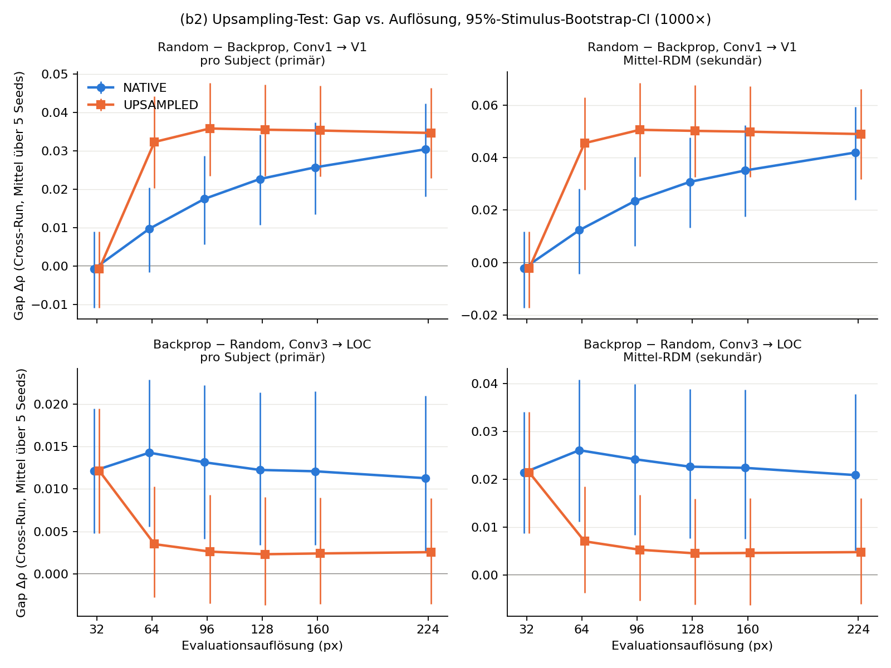

# (b2) Upsampling-Test — eval-only aus den 30 v12-Checkpoints

Lokal auf CPU (Intel Core Ultra 7 155U, torch 2.10.0+cpu), ohne Retraining. Code liegt in
`code/upsampling/` (step0 → step4). Das Kriterium wurde vor dem Lauf festgelegt und nicht verändert.

## Verdikt

**V1 (Hauptgrösse): Der Effekt hängt an der Inputgrösse bzw. der Rezeptivfeld-Geometrie (Fall A).**

Grundlage ist der Random−Backprop-Gap Conv1→V1 auf den Cross-Run-Paaren, pro Subject (primäre Konvention):

| | Gap @224 | 95%-Bootstrap-CI |
|---|---|---|
| NATIVE | +0.0304 | [+0.0181, +0.0423] |
| UPSAMPLED | +0.0347 | [+0.0229, +0.0464] |
| **R = UP/NAT** | **1.14** | **[1.03, 1.34]** |

R ≥ 0.5, und das CI von Gap_UP schliesst 0 aus. Das CI von R enthält 0 nicht. Die Mittel-RDM-Konvention
kommt zum selben Verdikt: R = 1.17 [1.05, 1.41].

Der Gap bleibt also vollständig erhalten, wenn der Bildinhalt auf 32 px begrenzt ist. Dafür braucht es
keine Bildinformation jenseits der Trainingsauflösung. UPSAMPLED liegt bei 224 px sogar leicht über NATIVE:
UP−NAT = +0.0042 [+0.0011, +0.0080].

**LOC (Sekundärgrösse): Der Effekt hängt am Informationsgehalt (Fall B).**

Gemeint ist der Backprop−Random-Gap Conv3→LOC, pro Subject. Hier ist R = 0.23 [−0.58, 0.83]; das CI von R
enthält 0. Gap_UP(224) = +0.0026 [−0.0036, +0.0089] ist nicht von 0 unterscheidbar. Mittel-RDM: R = 0.23
[−0.58, 0.74], ebenfalls Fall B.

Damit hängen die beiden Effekte des Papers an **verschiedenen** Faktoren. Der V1-Effekt folgt der
Inputgrösse, der LOC-Vorteil von Backprop am Bildinhalt jenseits von 32 px. (b1) ist nach dem Kriterium
nicht nötig. Es gab keinen unentschiedenen Fall.

---

## Schritt 0 — Offene Checks

Maschinenlesbar in `step0.json`.

**0.1 Trainingskonfiguration.**
- v12 trainiert mit `N_CIFAR = 8000`, `BATCH = 128` und `drop_last=True`. Das ergibt **62 Batches à 128 pro
  Epoche**, über **40 Epochen**. v11 ist identisch.
- Der Benchmark liest `N_CIFAR` und `BATCH` aus dem exec'ten v12-Namespace (`n_b = N_CIFAR // BATCH = 62`),
  dazu `N_EPOCHS_FULL = 40`.
- **Die Konfiguration stimmt überein; der Korrekturfaktor ist 1.0.** Die Trainingsprojektionen im Benchmark
  sind in dieser Hinsicht richtig.

**0.2 Checkpoints.**
- Auf dem Modal-Volume `learning-rules-rsa:/outputs_allseeds/checkpoints/` liegen **30 Checkpoints:
  6 Bedingungen × 5 Seeds**. Die Bedingungen sind Random Weights, Backprop, Feedback Alignment, Predictive
  Coding, STDP und Random Weights (BN-calibrated). Die Seeds sind 42, 123, 456, 789 und 1337 (`seed_idx` 0–4).
- Das Namensschema ist `model_weights_{rule}_seed{n}.pt`.
- Die Auflösung ist keine Checkpoint-Dimension, denn das Training ist auflösungsunabhängig.
- Die 30 Dateien habe ich nach `data/v12_checkpoints/` (gitignored) geladen. Alle 30 sind vorhanden und
  paarweise verschieden (sha256). Die Zuordnung steht in `step0.json → 0.2_checkpoints.inventory`.
- **Warum der Benchmark mit 25 rechnete:** `bench_compute.py` iteriert über `RULES5`, das die sechste
  Bedingung „Random Weights (BN-calibrated)“ auslässt. 5 Regeln × 5 Seeds ergeben 25.
- Zusätzlich hat der Benchmark für (b2) nur den UPSAMPLED-Arm gezählt. Gerechnet habe ich jetzt beide Arme
  für alle 30 Checkpoints.

**0.3 Eval-Modus für PC und STDP.**
- v12 ruft vor der Evaluation `model.eval()` auf. `PC_CNN` erbt dafür `nn.Module.eval()`; `STDP_CNN` hat
  eigene `train()`/`eval()`-Methoden, die `bn1` bis `bn3` direkt setzen.
- `extract_features` prüft das mit `assert_bn_eval` (`code/bn_guard.py`).
- Lokal nachgeprüft für alle 30 geladenen Modelle:
  - Alle BN-Layer haben `training=False`.
  - Die Features sind deterministisch.
  - Die Running-Stats bleiben durch die Extraktion unverändert.
  - PC und STDP haben nicht-triviale Running-Stats (kein Identity-BN).
- **Bestätigt.** Diese Analyse ruft dieselbe `extract_features`-Funktion inklusive Guard auf.

**0.4 Definition des UPSAMPLED-Arms.** Unverändert aus `code/learning_rules_v11_upsample_modal.py::_tf`:

```
NATIVE     (v12 _tf):  Resize(px) → CenterCrop(px) → ToTensor → Normalize(CIFAR)
UPSAMPLED  (v11 _tf):  Resize(32) → CenterCrop(32) → Resize(px) → ToTensor → Normalize(CIFAR)
```

- Alle Resize-Schritte sind bilinear mit Antialiasing.
- Das entspricht der Soll-Definition: Der Stimulus wird auf 32 px reduziert und dann auf r px hochskaliert.
  Der Informationsgehalt bleibt konstant, die Inputgrösse variiert. **Kein STOPP.**
- UPSAMPLED@32 ist bit-identisch zu NATIVE@32 (720/720 Bilder).
- v11-NATIVE (Interpolation explizit gesetzt) ist bit-identisch zu v12-NATIVE (Defaults), geprüft an 40/40
  Bildern bei 224 px.

## Schritt 1 — Paarmenge

- Die Stimulusreihenfolge (`stim_order_sub-0{1,2,3}.txt`, sha256 `e6e2125077df5291…`) und alle 12
  fMRI-RDMs (V1, V2, LOC, IT × 3 Subjects) sind **byte-identisch** zwischen
  `Projekte_1/learning-rules-rsa/outputs_720` und der Kopie auf `burstprop-data:/outputs_720`, die v12
  gelesen hat.
- Die Paarmenge P besteht aus den Paaren, die bei allen drei Subjects in verschiedenen Runs liegen
  (Run-Labels aus der THINGS-fMRI-Stimulus-Metadata).
- Ich habe P in `code/upsampling/common_up.py` neu implementiert. Die Index-Arrays sind **identisch** mit
  denen von `learning-rules-rsa/scripts/crossrun/common_cr.py::pair_set`.
- **|P| = 210'205** von 258'840 Paaren. ✓
- Alle 720 THINGS-Bilder werden mit v12's `find_img` aufgelöst. Die Bilder liegen lokal in
  `Projekte_1/RSA/Datensatz/images_THINGS/object_images`.

## Schritt 2 — Lauf und Validierung

**Umfang.** 6 Bedingungen × 5 Seeds × 6 Auflösungen × 2 Arme = 360 Evaluationen, jeweils 4 Layer-RDMs.

**Code.** Modelle, `extract_features` und `compute_rdm` stammen per AST unverändert aus dem v12-Skript, wie
schon in `bench_compute.py`. Abweichend ist nur, dass die Transformation einmal pro (Arm, px) angewendet
und der Tensor-Stack für alle 30 Modelle wiederverwendet wird.

**Laufzeit.**

| Schritt | Dauer |
|---|---|
| Extraktion | 42.5 min |
| RSA | ~3 min |
| Bootstrap (1001 Draws, 10 Prozesse) | 25 min |

**Ausgabe.** Die RSA-Werte stehen pro Seed in `rsa_seed{0..4}.csv`. Die Spalten sind `rule, seed, seed_idx,
arm, res, layer, roi, variant, convention, rho, rho_sub-01..03`:
- `variant=cr` ist die Cross-Run-Paarmenge (primär). `variant=all` umfasst alle Paare und dient nur der
  Validierung.
- `convention=persub` ist das Mittel über die drei Subject-ρ (primär). Die Einzelwerte stehen in
  `rho_sub-0x`.
- `convention=meanrdm` ist ρ gegen das Mittel-RDM (sekundär).

**Validierung** (Details in `step2.json`):
- **NATIVE/all gegen das v12-Sweep-CSV:** dieselben Checkpoints, aber GPU gegen CPU. Über alle 1'080 Zeilen
  ist die maximale Abweichung |Δρ| = 5.0e−7 bei Mittel-RDM und 5.0e−7 bei pro Subject. Das ist die Rundung
  des CSV auf 6 Stellen.
- **UPSAMPLED/all gegen v11 (`results/rsa_resolution_sweep_upsample.csv`, retrainierte Modelle):** Random,
  PC und STDP stimmen auf 5e−7 überein. Diese Regeln trainieren bit-identisch, also reproduziert die lokale
  Arm-Maschinerie v11 exakt. FA weicht um 1e−5 ab, BP um bis zu 6e−3. Das ist der dokumentierte
  GPU-Nichtdeterminismus des Retrainings.
- **Sanity-Gate:** NATIVE, Mittel-RDM, Cross-Run, Random−BP V1, Mittel über die Seeds:

  | px | Gap | Soll | Ergebnis |
  |---|---|---|---|
  | 224 | **+0.0420** | ≈ +0.043 | ✓ |
  | 32 | **−0.0022** | ≈ 0 | ✓ |

  Die crossrun-Referenz (bnfix-RDMs) liegt bei +0.0426 bzw. −0.0025. **Bestanden.**

## Schritt 3 — Auswertung

**Methode.**
- Der Gap ist der Mittelwert über 5 Seeds der gepaarten Differenzen pro Seed.
- Bootstrap: 1000 Stimulus-Resamples, dieselbe Indexmatrix wie in noise_ceiling_v2 und crossrun (Seed
  20261002, per sha256 geprüft).
- Die Resamples sind **gemeinsam für beide Arme**, alle Auflösungen, Seeds, Regeln und Konventionen.
- Pro Resample wird P neu bestimmt; der Median liegt bei 209'937 Paaren.
- Der Punktschätzer ist die Identitätsstichprobe. Sie reproduziert die Werte aus Schritt 2 exakt.

### Hauptgrösse: Random − Backprop, Conv1 → V1

Pro Subject (primär):

| px | NATIVE Gap [95%-CI] | Seeds>0 | UPSAMPLED Gap [95%-CI] | Seeds>0 |
|---|---|---|---|---|
| 32 | −0.0007 [−0.0109, +0.0090] | 3/5 | −0.0007 [−0.0109, +0.0090] | 3/5 |
| 64 | +0.0097 [−0.0016, +0.0205] | 3/5 | +0.0323 [+0.0203, +0.0442] | 5/5 |
| 96 | +0.0175 [+0.0057, +0.0288] | 5/5 | +0.0358 [+0.0235, +0.0477] | 5/5 |
| 128 | +0.0227 [+0.0107, +0.0342] | 5/5 | +0.0355 [+0.0234, +0.0472] | 5/5 |
| 160 | +0.0257 [+0.0135, +0.0374] | 5/5 | +0.0353 [+0.0233, +0.0470] | 5/5 |
| 224 | +0.0304 [+0.0181, +0.0423] | 5/5 | +0.0347 [+0.0229, +0.0464] | 5/5 |

Mittel-RDM (sekundär):

| px | NATIVE Gap [95%-CI] | Seeds>0 | UPSAMPLED Gap [95%-CI] | Seeds>0 |
|---|---|---|---|---|
| 32 | −0.0022 [−0.0174, +0.0117] | 3/5 | −0.0022 [−0.0174, +0.0117] | 3/5 |
| 64 | +0.0124 [−0.0042, +0.0282] | 3/5 | +0.0456 [+0.0277, +0.0631] | 5/5 |
| 96 | +0.0234 [+0.0063, +0.0404] | 5/5 | +0.0507 [+0.0329, +0.0685] | 5/5 |
| 128 | +0.0308 [+0.0133, +0.0478] | 5/5 | +0.0503 [+0.0327, +0.0678] | 5/5 |
| 160 | +0.0351 [+0.0175, +0.0523] | 5/5 | +0.0499 [+0.0325, +0.0673] | 5/5 |
| 224 | +0.0420 [+0.0239, +0.0593] | 5/5 | +0.0490 [+0.0318, +0.0662] | 5/5 |

### Sekundärgrösse: Backprop − Random, Conv3 → LOC

Pro Subject (primär):

| px | NATIVE Gap [95%-CI] | Seeds>0 | UPSAMPLED Gap [95%-CI] | Seeds>0 |
|---|---|---|---|---|
| 32 | +0.0121 [+0.0048, +0.0195] | 5/5 | +0.0121 [+0.0048, +0.0195] | 5/5 |
| 64 | +0.0143 [+0.0056, +0.0229] | 5/5 | +0.0035 [−0.0028, +0.0103] | 5/5 |
| 96 | +0.0132 [+0.0042, +0.0223] | 5/5 | +0.0026 [−0.0035, +0.0093] | 5/5 |
| 128 | +0.0123 [+0.0034, +0.0214] | 5/5 | +0.0023 [−0.0037, +0.0090] | 5/5 |
| 160 | +0.0121 [+0.0034, +0.0215] | 5/5 | +0.0024 [−0.0035, +0.0090] | 5/5 |
| 224 | +0.0113 [+0.0025, +0.0210] | 5/5 | +0.0026 [−0.0036, +0.0089] | 5/5 |

Mittel-RDM (sekundär):

| px | NATIVE Gap [95%-CI] | Seeds>0 | UPSAMPLED Gap [95%-CI] | Seeds>0 |
|---|---|---|---|---|
| 32 | +0.0214 [+0.0087, +0.0342] | 5/5 | +0.0214 [+0.0087, +0.0342] | 5/5 |
| 64 | +0.0261 [+0.0112, +0.0408] | 5/5 | +0.0070 [−0.0038, +0.0185] | 5/5 |
| 96 | +0.0242 [+0.0084, +0.0399] | 5/5 | +0.0053 [−0.0054, +0.0168] | 5/5 |
| 128 | +0.0226 [+0.0077, +0.0388] | 5/5 | +0.0045 [−0.0062, +0.0160] | 5/5 |
| 160 | +0.0224 [+0.0075, +0.0388] | 5/5 | +0.0046 [−0.0063, +0.0160] | 5/5 |
| 224 | +0.0209 [+0.0052, +0.0378] | 5/5 | +0.0048 [−0.0061, +0.0160] | 5/5 |

### Verhältnis R und Verdikt

| ROI | Konvention | Gap_NAT(224) [CI] | Gap_UP(224) [CI] | R [CI] | UP−NAT [CI] | Verdikt |
|---|---|---|---|---|---|---|
| **V1** | **persub** | +0.0304 [+0.0181, +0.0423] | +0.0347 [+0.0229, +0.0464] | **1.14 [1.03, 1.34]** | +0.0042 [+0.0011, +0.0080] | **A** |
| V1 | meanrdm | +0.0420 [+0.0239, +0.0593] | +0.0490 [+0.0318, +0.0662] | 1.17 [1.05, 1.41] | +0.0070 [+0.0024, +0.0125] | A |
| LOC | persub | +0.0113 [+0.0025, +0.0210] | +0.0026 [−0.0036, +0.0089] | 0.23 [−0.58, 0.83] | −0.0087 [−0.0165, −0.0013] | B |
| LOC | meanrdm | +0.0209 [+0.0052, +0.0378] | +0.0048 [−0.0061, +0.0160] | 0.23 [−0.58, 0.74] | −0.0161 [−0.0298, −0.0031] | B |

Bedeutung der Verdikte:
- **A:** R ≥ 0.5 und das CI von Gap_UP schliesst 0 aus. Der Effekt folgt Inputgrösse bzw. RF-Geometrie.
- **B:** Das CI von R enthält 0. Der Effekt folgt dem Informationsgehalt.

Beide Bedingungen gleichzeitig traten in keinem Fall auf.



`fig_gap_vs_resolution.{png,pdf}` zeigt beide Arme und beide Konventionen, die Fehlerbalken sind
95%-Stimulus-Bootstrap-CIs. Alle Zahlen stehen in `step4_gaps.csv` (inklusive Gap pro Seed und t-CI über
die Seeds), `step4_ratio.csv` und `step4.json`.

## Beschreibende Beobachtungen

Diese Beobachtungen sind nicht Teil des Kriteriums.

1. **Die Form der Kurven unterscheidet sich, auch wenn das Verdikt eindeutig ist.**
   - Unter NATIVE wächst der V1-Gap graduell mit der Auflösung.
   - Unter UPSAMPLED springt er schon bei 64 px auf seinen vollen Wert (+0.032) und bleibt bis 224 px flach.
   - Der Effekt ist also keine graduelle Funktion der Zahl gepoolter Positionen. Er tritt auf, sobald der
     Input grösser als die Trainingsauflösung ist **und** der Inhalt glatt (band-limitiert) bleibt.
   - Unter NATIVE kommt mit wachsender Auflösung gleichzeitig feiner Inhalt hinzu. Das scheint den Gap
     teilweise zu *bremsen*, nicht zu erzeugen; deshalb liegt NATIVE bei jeder Auflösung unter UPSAMPLED.
2. **Backprop treibt den V1-Gap, nicht Random.** Mittlere ρ pro Subject, Cross-Run, Conv1→V1:

   | Bedingung | @32 | NATIVE @224 | UPSAMPLED @64–224 |
   |---|---|---|---|
   | Random | 0.045 | 0.053 | 0.048–0.050 |
   | Backprop | 0.046 | 0.023 (fällt graduell) | 0.014–0.016 (fällt sofort) |

   - Random ist fast unempfindlich gegenüber dem Arm.
   - STDP verhält sich qualitativ wie Backprop: 0.042 → 0.027 (NATIVE) bzw. 0.018–0.022 (UPSAMPLED).
   - Lesart: Die bei 32 px gelernten Conv1-Filter passen schlecht zu Bildstrukturen, die relativ zum 3×3-RF
     vergrössert sind. Das ist ein Skalen- bzw. Geometrie-Mismatch und kein Effekt fehlender Information.
3. **LOC verhält sich umgekehrt.**
   - Der Backprop-Vorteil an LOC verschwindet unter UPSAMPLED, weil Backprop-ρ an LOC auf ≈ 0 fällt (0.011 →
     −0.0003). Random bleibt unverändert.
   - Das Verdikt B stützt sich darauf, dass das CI von R 0 enthält. R ist hier allerdings breit und instabil,
     weil der Nenner Gap_NAT(224) nahe bei 0 liegt (CI-Untergrenze +0.0025; in 0.8 % der Resamples ist er
     ≤ 0).
   - Die robustere Zusatzgrösse UP−NAT = −0.0087 [−0.0165, −0.0013] bestätigt die Richtung: Der Gap ist
     unter UPSAMPLED reliabel kleiner.
4. **Konsistenz mit v11.**
   - Der frühere v11-Lauf (retrainierte Modelle, alle Paare, Mittel-RDM) hatte UPSAMPLED +0.050 und NATIVE
     +0.044 bei 224 px.
   - Mit v12-Checkpoints, der Cross-Run-Paarmenge und Bootstrap-CIs ändert sich das qualitativ nicht.
   - Neu sind die CIs, die primäre Konvention pro Subject und die Kontrolle für die Run- bzw.
     Präsentationsreihenfolge über die Cross-Run-Paare.

## Einschränkungen

- Die Inferenz läuft über Stimuli (Bootstrap) und ist über 5 Seeds gemittelt. Die Seed-Variabilität steht
  zusätzlich als t-CI in `step4_gaps.csv`, geht aber nicht ins Kriterium ein.
- Bei BP und FA kommt die dokumentierte Retrain-Nichtdeterminiertheit hinzu (`RETRAIN_REPORT.md`). Diese
  Analyse benutzt aber genau die v12-Checkpoints, deren Werte im v12-CSV stehen (Abweichung ≤ 5e−7).
- UPSAMPLED-Bilder sind band-limitiert *und* glatter als natürliche Bilder bei derselben Grösse. Der Test
  trennt Informationsgehalt von Inputgrösse, isoliert aber nicht, welche Eigenschaft der glatten
  Hochskalierung (Frequenzspektrum, lokale Kontraste) den Backprop-Abfall an V1 verursacht.
- Nur die 3-Conv-CNN wurde untersucht.

## Reproduktion

```
# Checkpoints + v12-CSV vom Modal-Volume (einmalig; nach data/, gitignored)
python -m modal volume get learning-rules-rsa outputs_allseeds/checkpoints/ data/v12_checkpoints
python -m modal volume get learning-rules-rsa outputs_allseeds/rsa_resolution_sweep.csv data/v12_rsa_resolution_sweep.csv
# Zum Vergleich: outputs_720-Dateien von burstprop-data nach data/modal_outputs_720/
cd code/upsampling
python step0_checks.py      # Schritt 0 + Paarmengen-Checks  -> step0.json
python step1_extract.py     # Modell-RDMs (resumable)        -> data/upsampling/rdms/
python step2_rsa.py         # RSA, Validierung, Sanity-Gate  -> rsa_seed*.csv, step2.json
python step3_bootstrap.py   # 1000 Resamples (resumable)     -> data/upsampling/boot_parts.jsonl
python step4_evaluate.py    # Gaps, R, Verdikt, Abbildung    -> step4_*.csv, step4.json, fig_*
```

Externe Pfade, die in `common_up.py` gesetzt sind:
- `Projekte_1/learning-rules-rsa`: fMRI-RDMs, Stimulusreihenfolge, crossrun-Referenz und
  noise_ceiling_v2-Resample-Hash.
- `Projekte_1/RSA/Datensatz`: Stimulus-Metadata und THINGS-Bilder.

Paper-Dateien wurden nicht verändert.
